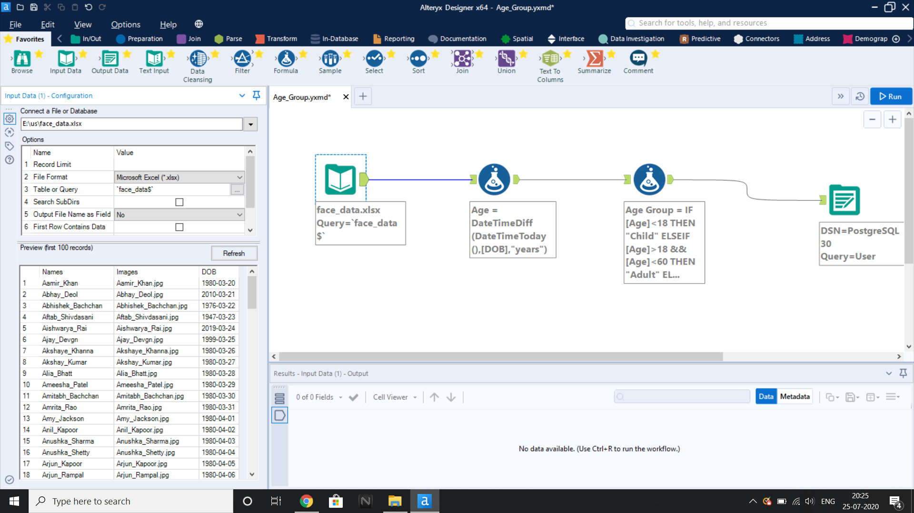
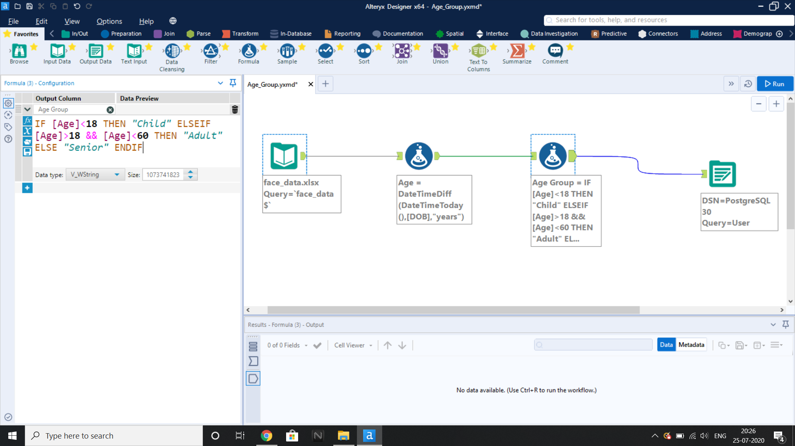
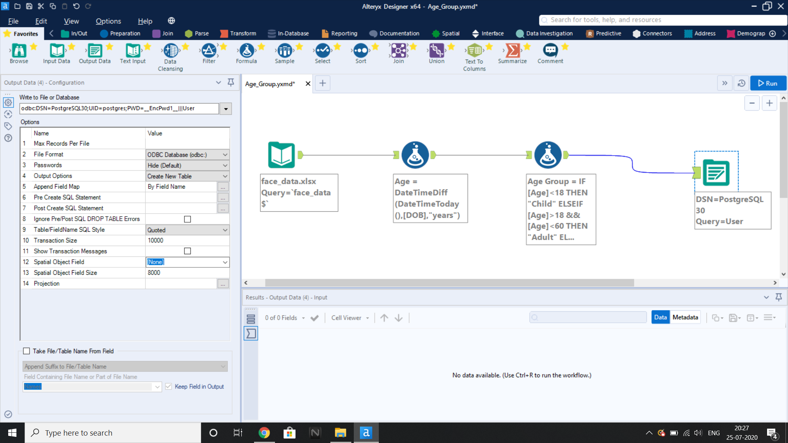

# Data_Transformation_From_Altryx_ETL_Tool_To_Database
In this the Altryx ETL tool will take a user info CSV file as input and computes Age and categorizes each Age Group.  
 

Input file 
 

The formula to get Age from Date of Birth 
 

The formula to categorize Age Group  
 

Output to PostgreSQL Database 
 
