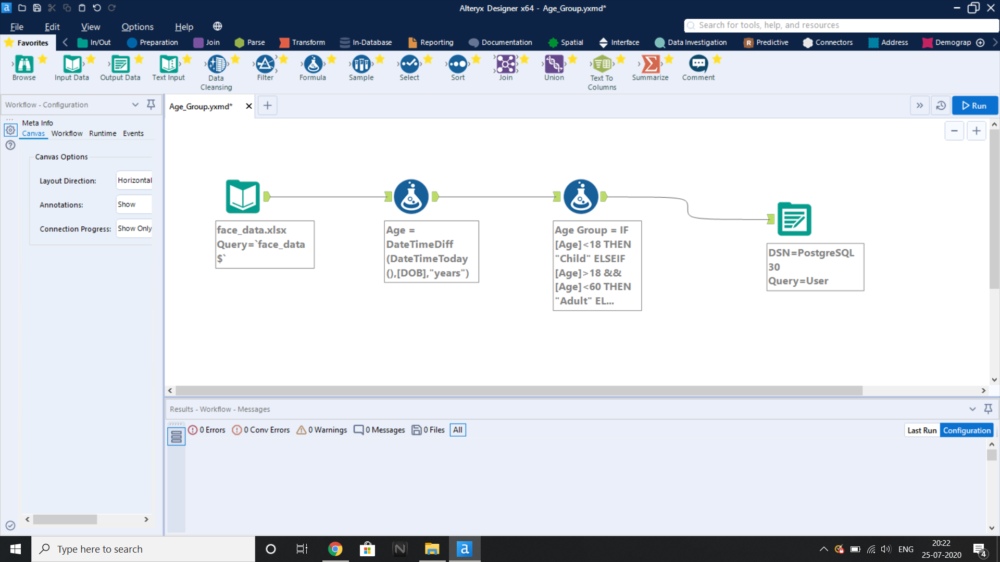

# Data_Transformation_From_Altryx_ETL_Tool_To_Database
In this the Altryx ETL tool will take a user info CSV file as input and computes Age and categorizes each Age Group.  
 
 

Input file
 

The formula to get Age from Date of Birth
 
 

The formula to categorize Age Group 
 
 

Output to PostgreSQL Database
 
 
